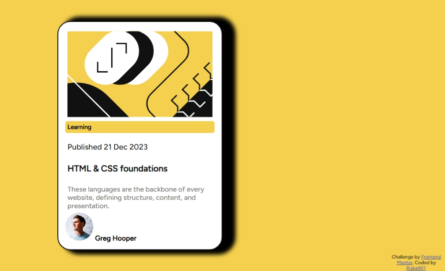

# Frontend Mentor - Blog preview card solution

This is a solution to the [Blog preview card challenge on Frontend Mentor](https://www.frontendmentor.io/challenges/blog-preview-card-ckPaj01IcS). Frontend Mentor challenges help you improve your coding skills by building realistic projects. 

## Table of contents

- [Overview](#overview)
  - [The challenge](#the-challenge)
  - [Screenshot](#screenshot)
  - [Links](#links)
- [My process](#my-process)
  - [Built with](#built-with)
  - [What I learned](#what-i-learned)
  - [Continued development](#continued-development)
  - [Useful resources](#useful-resources)
- [Author](#author)

## Overview

### The challenge

Users should be able to:

- See hover and focus states for all interactive elements on the page

### Screenshot

### Links

- Solution URL: [Github](https://github.com/Riska997/blog-preview-card-main.git)
- Live Site URL: [Github Pages](https://riska997.github.io/blog-preview-card-main/)

## My process

### Built with

- Semantic HTML5 markup
- CSS custom properties
- Flexbox
- CSS Grid
- Mobile-first workflow

### What I learned

In this project, I learned how to structure a blog preview card using HTML and style it using CSS. Here are some key takeaways:

- How to use semantic HTML elements for better accessibility and SEO.
- Utilizing CSS flexbox for layout positioning and alignment.
- Employing CSS custom properties to maintain consistency and ease of updates.
- Implementing a mobile-first approach to ensure responsiveness across devices.

### Continued development

I plan to continue exploring more advanced CSS techniques and refining my layout skills. Additionally, I aim to delve deeper into JavaScript to enhance interactivity and user experience in future projects.

### Useful resources

- [W3school](https://www.w3schools.com/) 

## Author

- LinkedIn - [Prisca Mulishi](https://github.com/Riska997/huddle-landing-page-with-alternating-feature-blocks-master/blob/main/www.linkedin.com/in/prisca-mulishi-3994702a2)
- Frontend Mentor - [@Riska997](https://www.frontendmentor.io/profile/Riska997)
- Facebook - [@mumu.479459](https://www.facebook.com/mumu.479459/)
